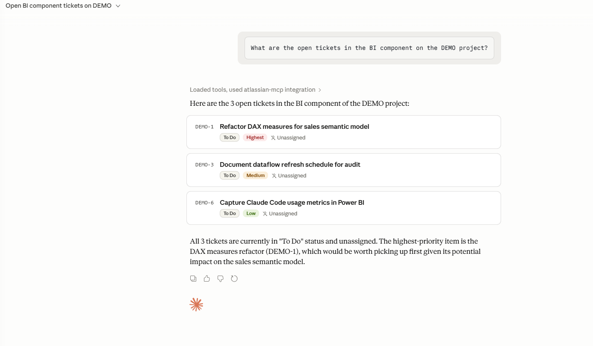

# atlassian-mcp

A read-only [MCP server](https://modelcontextprotocol.io) exposing Jira and Confluence operations to Claude. Built as a portable, standalone demonstration of the agentic Atlassian workflows in routine production use.

> *"Delivered ~2× capacity increase for Enterprise Solutions on BI and Jira/JSM tasks, unlocking a backlog previously blocked by manual effort constraints."*
>
> — from the author's *AI Development & Engineering — Projects & Contributions* CV supplement

This repo is a focused, self-contained slice of that pattern: Claude querying Jira through a custom MCP server, called as a tool from an ordinary conversation.

## What it does

Without an MCP server, Claude has no access to your Jira:

> **You:** What are the open tickets in the BI component on the DEMO project?
>
> **Claude:** I don't have access to your Jira. You'd need to check it manually.

With this server running:

> **You:** What are the open tickets in the BI component on the DEMO project?
>
> **Claude:** *(calls `list_open_tickets_by_component("DEMO", "BI")` against your Jira)*
>
> *"Here are the 3 open tickets in the BI component of the DEMO project: DEMO-1 'Refactor DAX measures for sales semantic model' (Highest, To Do), DEMO-3 'Document dataflow refresh schedule for audit' (Medium), DEMO-6 'Capture Claude Code usage metrics in Power BI' (Low). The highest-priority item is DEMO-1, worth picking up first given its impact on the sales semantic model."*

Claude is the bridge between natural-language intent and JQL.

## Demo



Claude routes the natural-language question to this server, receives the three tickets sorted by priority (Highest → Medium → Low — the JQL `ORDER BY priority DESC, updated DESC` is doing its job), and adds an analytic summary identifying which item to pick up first.

## Architecture

```
┌──────────────────┐
│  Claude Desktop  │   natural-language interface
└────────┬─────────┘
         │ stdio (JSON-RPC, MCP protocol)
         │
┌────────▼─────────┐
│   atlassian-mcp  │   this repo
│  FastMCP + httpx │   (Python ≥3.11, async)
└────────┬─────────┘
         │ HTTPS + basic auth
         │
┌────────▼─────────┐
│    Atlassian     │
│    Cloud REST    │   Jira / Confluence
└──────────────────┘
```

Single Python package, async throughout, stdio transport (Claude Desktop's). Authentication is basic auth — email plus an Atlassian API token — read from environment variables at server startup. Sufficient for a single-user local server; OAuth 2.0 / 3LO is the production path (see *Not in scope* below).

## Quick start

### 1. Configure credentials

Copy `.env.example` to `.env` and fill in three values:

```
ATLASSIAN_BASE_URL=https://your-tenant.atlassian.net
ATLASSIAN_EMAIL=you@example.com
ATLASSIAN_API_TOKEN=...
```

Generate an API token at <https://id.atlassian.com/manage-profile/security/api-tokens>.

### 2. Install dependencies

```
uv sync
```

(Requires [uv](https://docs.astral.sh/uv/); falls back to `pip install -e .` if you prefer.)

### 3. Register the server with Claude Desktop

In **Claude Desktop → Settings → Developer → Edit Config**, add this entry under `mcpServers`:

```json
{
  "mcpServers": {
    "atlassian-mcp": {
      "command": "uv",
      "args": ["--directory", "<absolute-path-to-this-repo>", "run", "atlassian-mcp"]
    }
  }
}
```

Save and fully quit Claude Desktop (system tray → Quit; closing the window isn't enough), then relaunch. The server appears in **Settings → Developer → Local MCP servers** with a `running` indicator.

### 4. Try it

Open a new chat in Claude Desktop and ask a natural question about open tickets, e.g. *"What are the open tickets in the BI component on the DEMO project?"* Claude prompts for permission to call the tool, returns the tickets, and adds reasoning.

## Available tools

### `list_open_tickets_by_component(project_key, component, limit=25)`

Open issues in a project filtered by component, sorted by priority then last-updated.

Generated JQL:

```
project = "<project_key>" AND component = "<component>" AND statusCategory != Done
ORDER BY priority DESC, updated DESC
```

Hits Jira's modern `/rest/api/3/search/jql` endpoint. Returns key, summary, status, priority, assignee display name, and updated timestamp for each issue.

### Planned

- `summarise_recent_changes(project_key, days=7)` — recent changelog activity formatted for narrative output
- `find_assets_referencing(query)` — Jira Assets / Insight lookup
- `generate_weekly_status_from_jira(project_key)` — closed-this-week tickets grouped by team; produces a draft status update

## Adding a tool

Tools live in [`src/atlassian_mcp/server.py`](src/atlassian_mcp/server.py) as functions decorated with `@mcp.tool()`. REST work lives in [`src/atlassian_mcp/atlassian.py`](src/atlassian_mcp/atlassian.py) as methods on `AtlassianClient`. Keep the tool function thin; put the HTTP and JSON-shaping work in the client.

## Not in scope

Deliberate boundaries — kept tight so the demo is safe to walk through at interview and so the codebase doesn't drift into half-finished surface area:

- **Write operations.** No creating, transitioning, or deleting issues; no editing Confluence pages. Read-only by design.
- **OAuth 2.0 / 3LO.** The production auth path. Basic auth is used here for single-user local-demo simplicity. The migration path is straightforward (swap `httpx.AsyncClient`'s `auth=` for an OAuth flow plus token refresh) but it adds a day's worth of scope without changing what the demo evidences.
- **Anything outside Jira and Confluence.** No GitHub, Slack, Linear, etc. — those each have their own MCP servers.
- **Tests, lint config, CI, pre-commit hooks.** Not yet. This is a weekend-shaped portfolio artefact, not a framework. The scaffolding earns its keep when there's something to maintain; right now it would just be noise.

## About the author

[Toby Rogers](https://www.linkedin.com/in/tobyalexanderrogers/) — Enterprise Solutions Senior Engineer at InvestCloud Italy, 30+ years building enterprise platforms across financial services. Currently focused on the intersection of Atlassian administration, Power BI architecture, and applied AI engineering with Claude Code and MCP. MSc in Computer Development (AI & Neural Networks).

This repo is one slice of a wider portfolio. The full *Projects & Contributions* supplement (AI, BI, Atlassian) is in the LinkedIn profile's Featured section.
